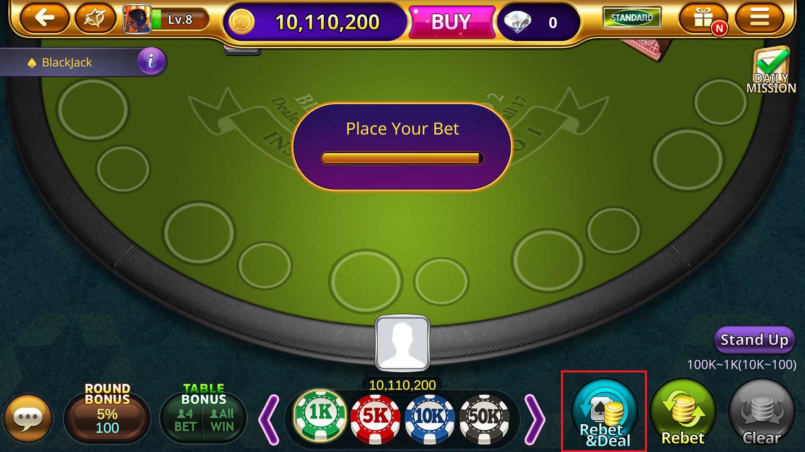

# Blackjack Bot

This Blackjack bot is a bot that will automatically play 
Blackjack for the user.

## This Project

When blackjack_bot.py is run, the game will automatically 
play for the player.
Currently, the bot has been adapted to work 
for Casino Stars Season 2 on Facebook. 

## Warning

CasinoStar2 services have been closed as of July 29, 2022, so this project can no longer be used.

## Instructions

Open Casino Stars Season 2 on the Facebook website and make 
it full-screen. Then, navigate to the Blackjack lobby and sit
in the middle seat. The user must manually bet a certain amount.
After this, the program will take over (This program has
only been tested using PyCharm). Press the escape
button on your keyboard to end the bot. 

## How The Bot Works

The blackjack_bot.py file is the main file for this program.
The bot will constantly check if it is the player's turn by
seeing if the hit-button has lit up. Here, the bot will read the
dealer's and player's numbers. The following image shows
in red squares all the previous mentioned locations which the bot 
looks for existing images.

Picture 1: Player-turn screen and locations of image recognition

The program will function a little differently if the split option
is available. thus, the bot would first check
if the split option was available as soon as it was the player's
turn. The following image shows in a red square the location
which the bot checks to see if the split option is available.

Picture 2: Split screen and location of image recognition

Now, the bot has all the information to make the most optimal
decision (hit, stand, surrender, double, or split) based on the 
rules provided by the blackjack_calculator.py file. The bot does 
not support counting cards for now. 

In order to keep the program running continuously, it must be able
to re-bet whenever the option is up. The following image shows in
a red square the location which the bot checks to see
if the re-bet option is available.

Picture 3: Re-bet screen and location of image recognition

If it was not clear already, the bot automatically moves the cursor
and clicks on the correct location.
## References

I based my calculator on 
[this](https://wizardofodds.com/games/caribbean-blackjack/images/basic-strategy.png)
link.
